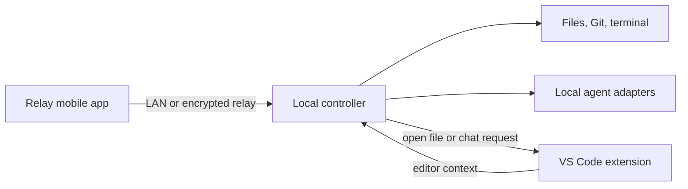

# Relay by Bytical

Relay is a mobile control plane for the local coding agents, development machine, and VS Code
workspace you already use. Start work at your desk, follow it from your phone, and return with the
session, decisions, and changes in context.

**Relay is an alpha product of Bytical.** It is not a mobile replacement for VS Code and it does
not move source code or model-provider credentials into a Bytical cloud account.

## What works today

- Pair an Android phone with a Windows controller using a QR flow and encrypted device channel.
- Browse indexed projects and files, view Git status and diffs, and inspect controller health.
- Start, continue, approve, stop, and replay controller-owned Copilot ACP sessions.
- See VS Code editor state, diagnostics, terminal activity, and use `RDC: Open in Agents` from the
	VS Code Command Palette.
- Create and reattach to controller-owned terminals.
- Connect directly over LAN, with an experimental encrypted relay path for remote access.

## Alpha safety note

Relay is actively being hardened. Do not expose the controller or relay directly to the public
internet, and do not rely on it for production access control yet. The public-release priorities are
device capability enforcement, token lifecycle controls, audited privileged actions, TLS relay
transport, and release-build push notifications. See [PRODUCT-DIRECTION.md](PRODUCT-DIRECTION.md).

## Architecture



The laptop remains the source of truth. Relay persists replayable controller events so a phone can
reconnect without pretending it is a second desktop environment.

## Quick start

Prerequisites: Node.js 22.13 or later and pnpm 10.

```sh
corepack enable
pnpm install
pnpm typecheck
pnpm test
pnpm lint
pnpm --filter @rdc/desktop-controller dev
```

The controller prints a local dashboard URL. Open it on the computer, choose **Pair device**, then
scan the pairing QR from the Relay mobile app.

To run the mobile app during development:

```sh
pnpm --filter @rdc/mobile start
```

To build and run the VS Code extension locally:

```sh
pnpm --filter rdc-vscode build
code --extensionDevelopmentPath="$(pwd)/extensions/vscode"
```

Open the Command Palette in the extension host and run **RDC: Open in Agents** to begin a
controller-owned session in the active workspace.

## Website

The public product site lives in [apps/site](apps/site). Run it locally with:

```sh
pnpm --filter @bytical/relay-site dev
```

The public alpha is live at [relay-bytical.vercel.app](https://relay-bytical.vercel.app). It is
automatically deployed from this repository's `main` branch by an isolated Vercel project rooted at
`apps/site`. The intended branded address is `relay.bytical.ai`; its DNS cutover is the only
remaining website-hosting step. Deployment details are in [apps/site/README.md](apps/site/README.md).

## Contributing

Contributions are welcome. Read [CONTRIBUTING.md](CONTRIBUTING.md) for setup, scope ownership,
validation requirements, and pull-request expectations. Please read [SECURITY.md](SECURITY.md)
before reporting a potential security issue.

## License

Copyright 2026 Bytical. Licensed under [Apache-2.0](LICENSE).
